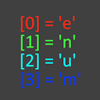
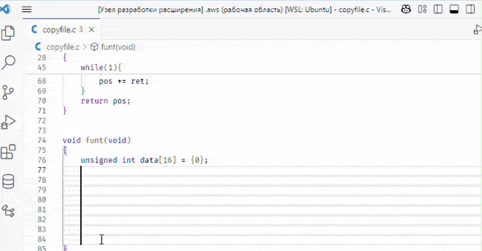

# ENUMERATOR

Plugin for inserting enumerated values ​​in multi-cursor mode

## Features

Allows you to enter numbers in decimal and hexadecimal formats.

A generalized command with template input is called by pressing `CTRL+ALT+E` or by selecting the command in the command palette
The template allows you to set the number format, the starting point, and the increment step.

Also for all formats there are separate commands with start = 0 and step = 1.

*The code in the video is just an example of using the plugin, and is not working. Yes, I know that there is an array out of bounds. This is just an example!*

## Data Format

`[0|x]<start> [<step>]`

format - values ​​from the list: 0.x is empty. 
If format is 0 - will pad with zeros to an even length
If format is x - start and step values ​​are entered in hexadecimal format
If format is empty - decimal numbers without zero-padding are used

Examples of formats and results of their processing:

* `01` -> `01 02 03 04 05 05`
* `098` -> `098 099 100 101 102 103`
* `1` -> `1 2 3 4 5 6`
* `98` -> `98 99 100 101 102 103`
* `x9` -> `9 a b c d e`
* `04 4` -> `04 08 12 16 20`
* `4 4` -> `4 8 12 16 20`
* `xf4 4` -> `0f4 0f8 0fc 100 104`
